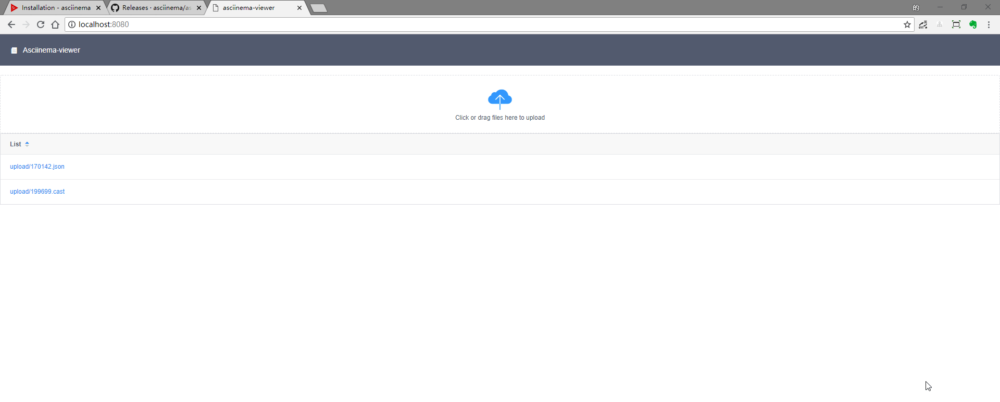

# asciinema-viewer

简单的asciinema文件展示

基于asciinema-player v2.6.1 + iview 3.x + beego 



## docker 

```
docker run -d -p 8006:8080 \
--restart=always \
[--privileged=true \]
-v $HOME/app/asciinema-view-data:/data/upload \
zhizuqiu/asciinema-viewer:latest
```

## build

iview-project为前端项目

```
cd iview-project
npm install
npm run init
npm run build
```

将生成的`dist/`和`index.html`复制到`static`和`views`目录下

```
GOOS=linux GOARCH=amd64 go build .
```

## Development

```
bee run
```

```
cd iview-project
npm install
npm run init
npm run dev
```